# Pre-req.: New Azure User Setup

> [!NOTE]
> 
> Back to [Readme](/README.md)

## Obtain your user credential from the organizers of this event.

During the very start of this event, you will receive the credentials for new Azure / Fabric user. This user is new even for the working tenant and needs to be onboarded by you. This process is quite easy and includes multiple steps. 

During the process you will need some private *authenticator* app such as **Microsoft Authenticator** or **Google Authenticator**

You will receive the credentials in the following format:

> **Credentials**
> 
> | Login | Password |
> |-------|----------|
> | `UserXX@fabric.microhack.org` | `dummyHeslo1234` |

## Actions

### Setup the Azure Portal access and onboard the user account

1) Open the website https://portal.azure.com and if you are logged in with your account, *Sign out* first. Alternatively, open the website in a Private browser window.

2) Log in with your user and password.

3) In this step, you will be prompted to add your own authenticator and enable multi-factor authentication.

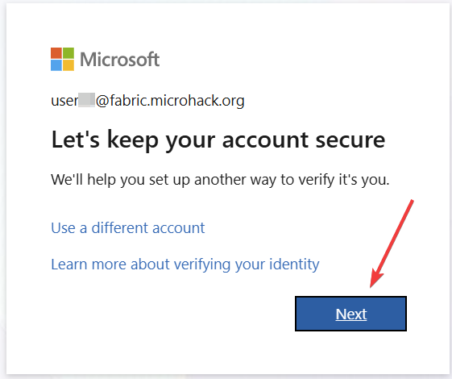
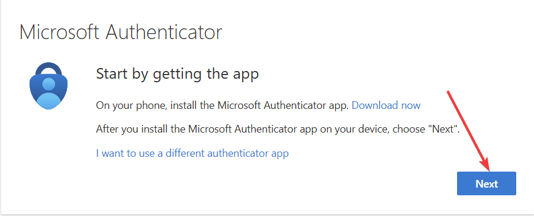
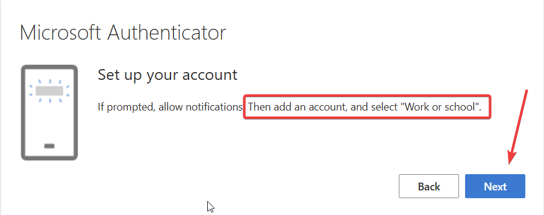

In your Authenticator app, don't forge to choose the "Work or School" account as instructed. After you scan the code, click NEXT.

On the next screen, you will be prompted with the number - authenticate on your phone authenticator app with that number.

The resulting screen should look like the following - finish the wizard.

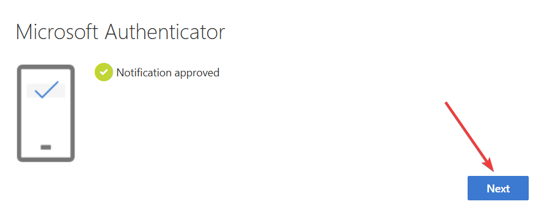

At this stage, you will have to *change the password* - choose some of your own and store your new password somewhere wisely.

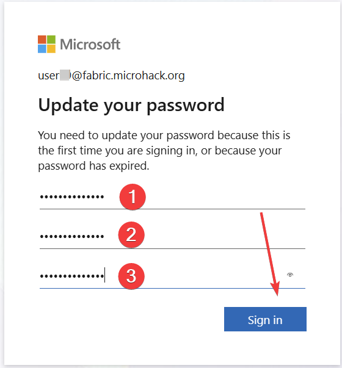

At this stage, *your account is SET in Microsoft Entra!!!*

### Activate the Power BI Pro Trial account

1) Go to the Fabric native website - https://app.fabric.microsoft.com/ (similar approach is feasible also on an alternative URL - https://app.powerbi.com/).

2) Sign-up with your newly onboarded user (you may be prompted to sign-in or since you signed-in within the previous steps, the process could continue immediately without requiring password and MFA)

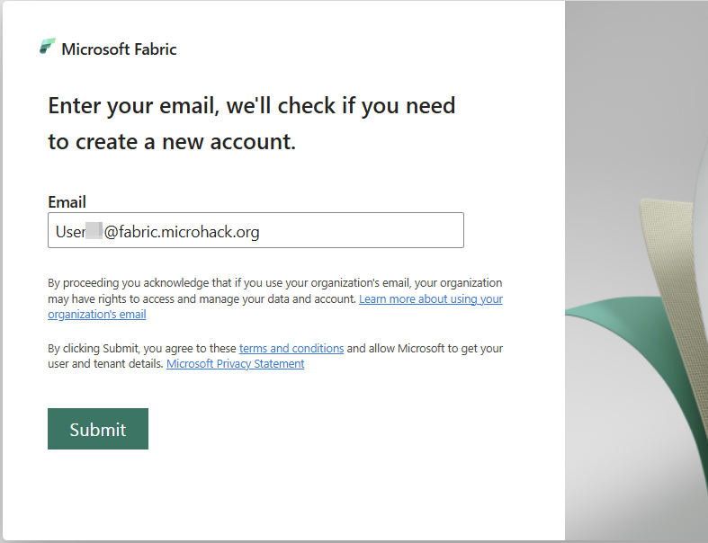

In the upper right corner, you can see the *Power BI Free* license was automatically assigned to this user, however for the purpose of this MicroHack we would need to thave Power BI Pro Trial assigned on top of that.

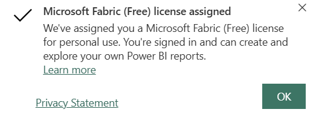

3) To initiate the offer for the Power BI Pro Trial, we need to create some activity requiring such a license - so we will choose the simplest one of them. *Create a Workspace*. Click on the Workspaces in the left pane and click the button at the bottom of the page:

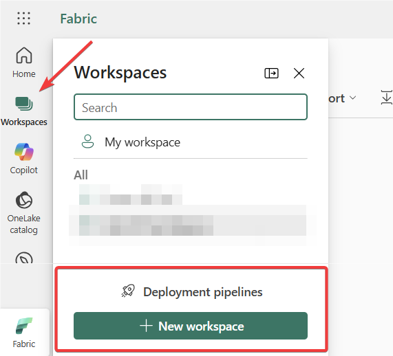

4) Once the popup pane shows up, give your new workspace a name and in the *Advanced* section make sure the "backed up" by the **Pro** license.

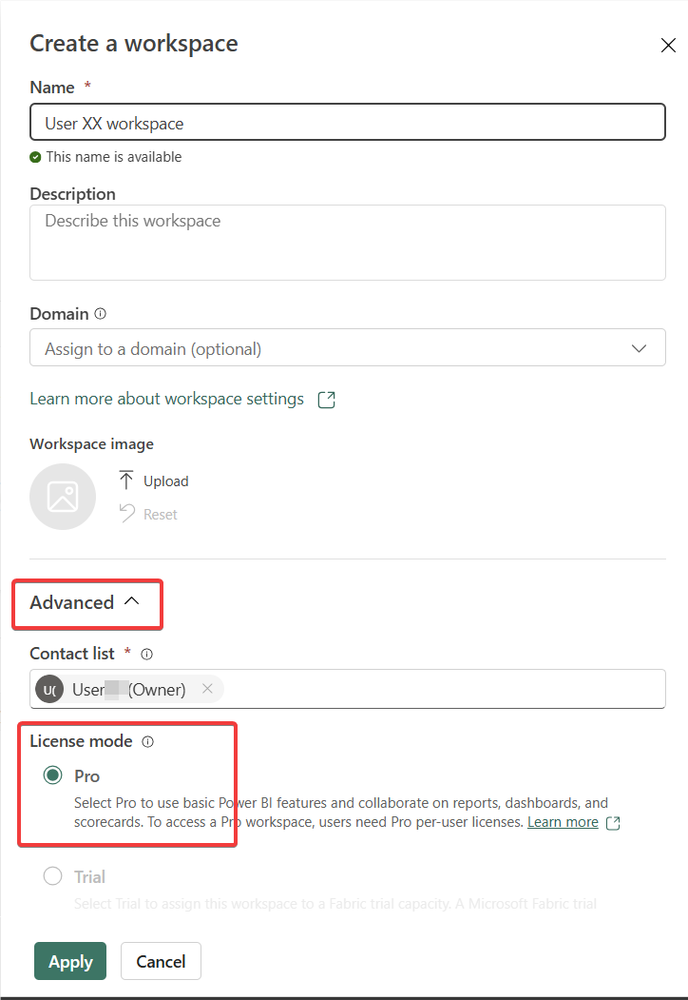

5) Since the Pro license is needed for this step, you will be prompted, whether you want to Buy or try the new license. Click on the *Try Free* option within the dialog.

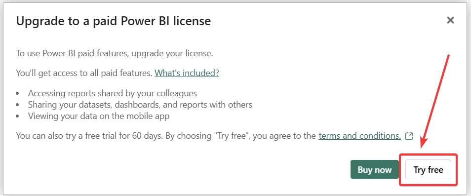

6) You have now activated the **Power BI Trial** license for your account and the dialog popup should confirm that.

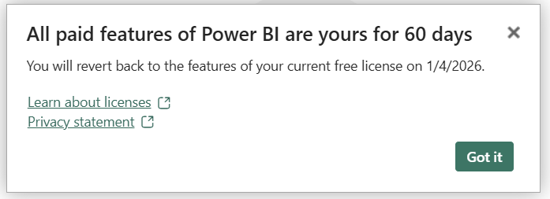

## Success Criteria

- Azure portal user able to login
- Microsoft Fabric user logged in and Power BI Trial license active

## Next challenge is:
>[Challenge 01](/challenges/ch01/README.md)
