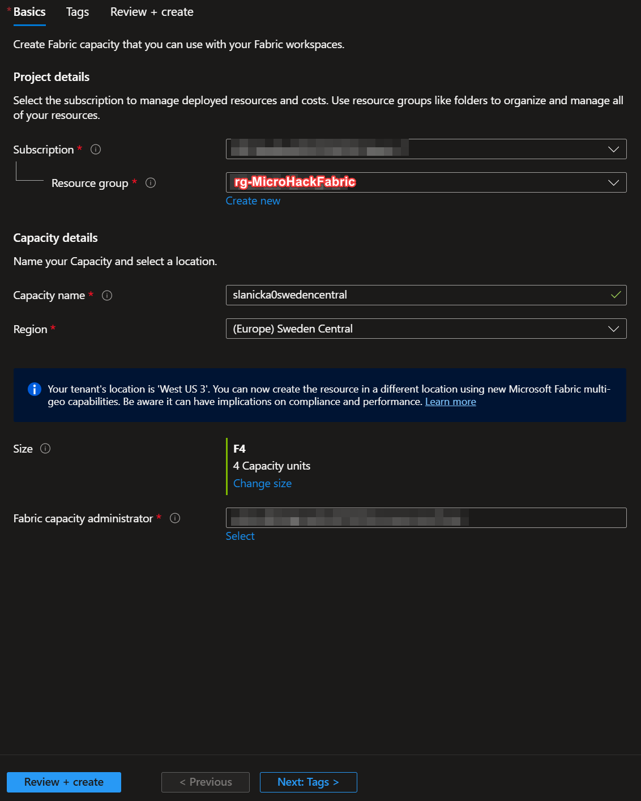
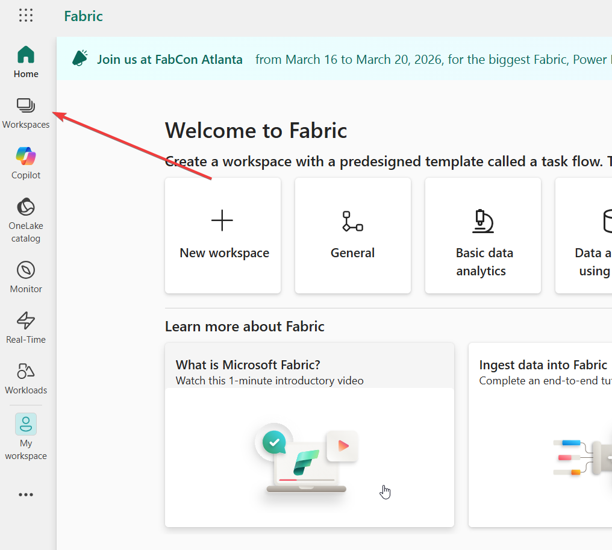
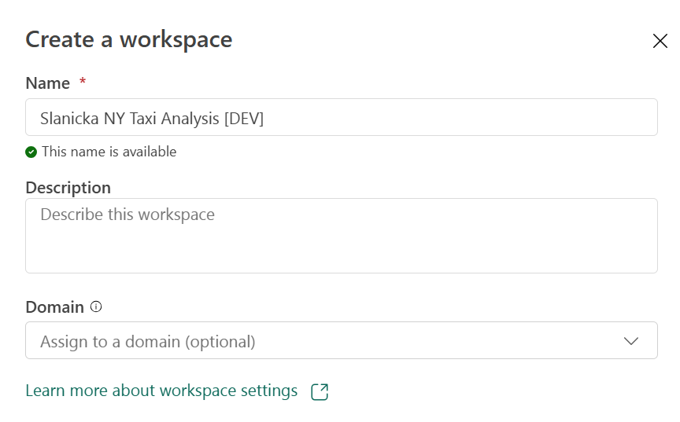
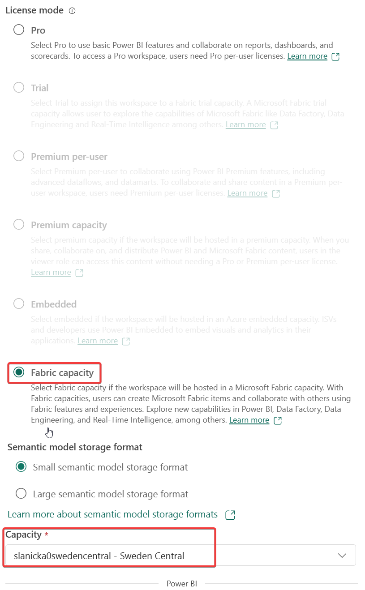
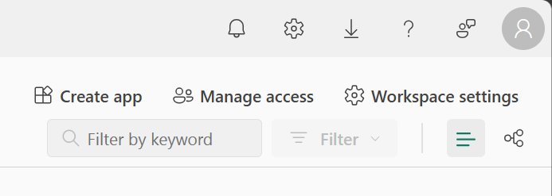
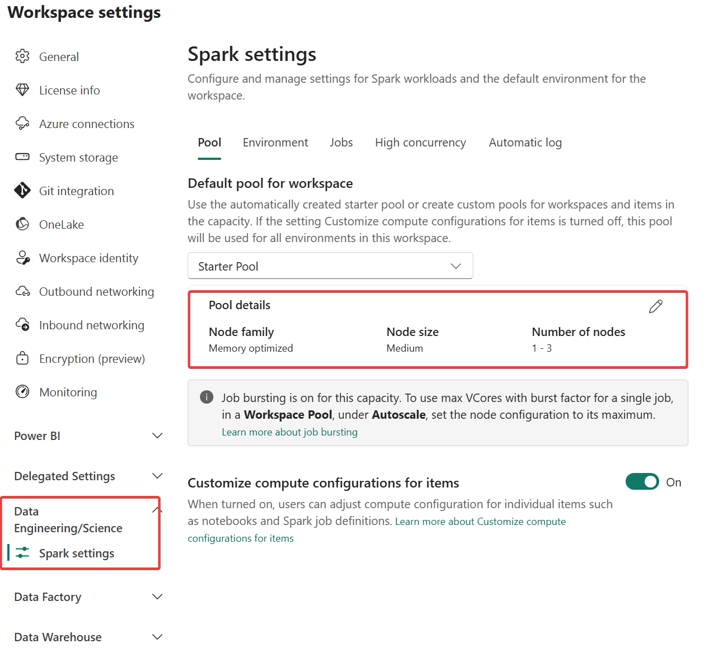
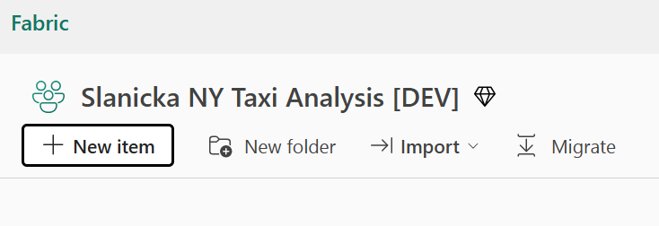
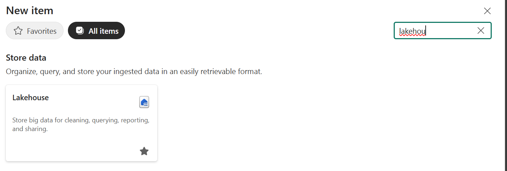
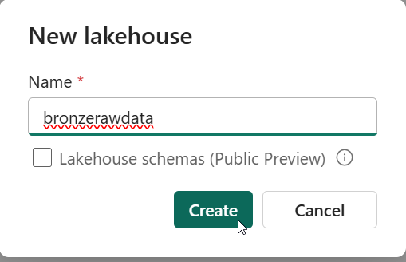

# Ch01: Solution - Prepare MS Fabric for your workloads

## Actions
---
### Deploy MS Fabric Capacity: **yoursurname0region** with **size F4**.
- search for the Fabric capacities within Azure portal
- using the wizard, create the capacity according to the picture below
- place it within whatever region which suits your needs

---
### Create Workspace in MS Fabric: **YourSurname NY Taxi Analysis [DEV]**
	- e.g. Novak NY Taxi Analysis [DEV]
- go to Microsoft Fabric - https://app.fabric.microsoft.com/
- sign in with your M365 account [XXXXXXX]

- create workspace as instructed

During the same process assign previously created Fabric Capacity to your new workspace.

---
### Change Spark settings: **Use 1 node only**

- reach the newly created workspace settings

- find the settings related to Spark and modify the nodes setting accordingly

---
### Create the 1st lakehouse: **bronzerawdata**

- return to your created newly created workspace and create new item

- this option lists all the various items you can create within the Fabric environment. Seach for the **Lakehouse** option (you can favourite it if needed for future)

- create the new lakehouse with the proper name

---
