# Ch02: Solution - Ingest data with data pipelines and shortcuts 

### Actions
--- 
### Create Pipeline: Ingest Green Taxi 2015

The goal is to copy the files from the remote location into your lakehouse. This solution shows the Pipeline + Copy Data activity however you can choose different method

1) Create New Item in your previously created Workspace and choose Pipeline from the list

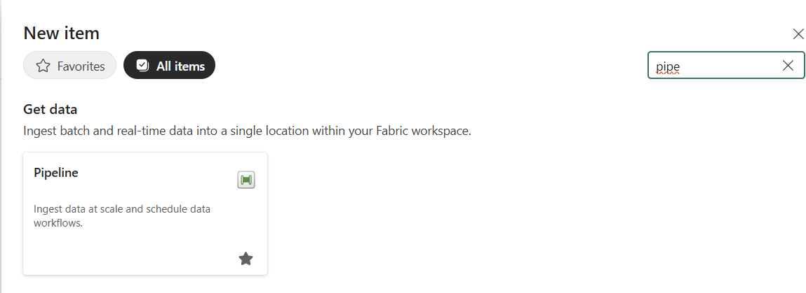

2) Give your pipeline some proper name

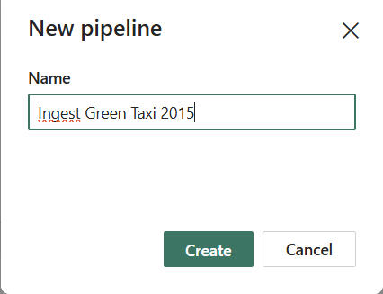

3) The new pipeline canvas is created with several wizards at your disposal. You can choose some of them however to create a clean canvas for pipeline activity, choose (...) *Pipeline activity* :-) and from the suggested steps, choose the *Copy data* option:

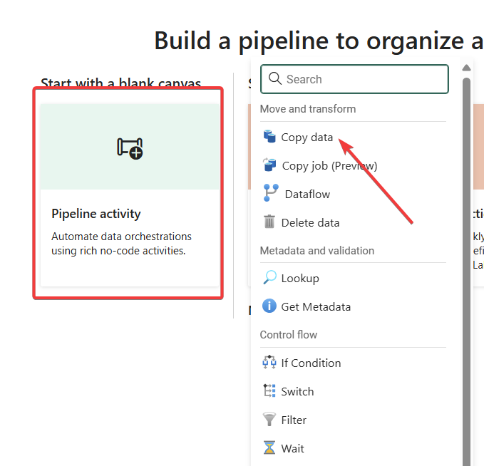

4) 

The pipeline canvas is shown and Copy data activity is added onto it. On this canvas you can chain various options how to copy and transform the data. We will only copy the data from the source and place it into your lakehouse. Fill in the following inputs.

| **Item** | **Property** | **Value** |
|:--------------|:-------------|:----------|
| **Source** | Type | Azure Blob Storage |
| | URL | `https://stfabricmicrohacksw.blob.core.windows.net/` |
| | SAS Token | `sv=2024-11-04&ss=b&srt=sco&sp=rlfx&se=2025-11-30T00:36:28Z&st=2025-10-06T15:21:28Z&spr=https&sig=AukZMGIOO%2BdjC%2BAbRmaNpGsg8jagziY0WimASjtiTZw%3D` |
| | Format | **Binary** |
| **Destination** | Type | Lakehouse |
| | Name | **bronzerawdata** |
| | File Path | **Landing/GreenTaxi2015** |
| | Format | **Binary** |

**Source:**

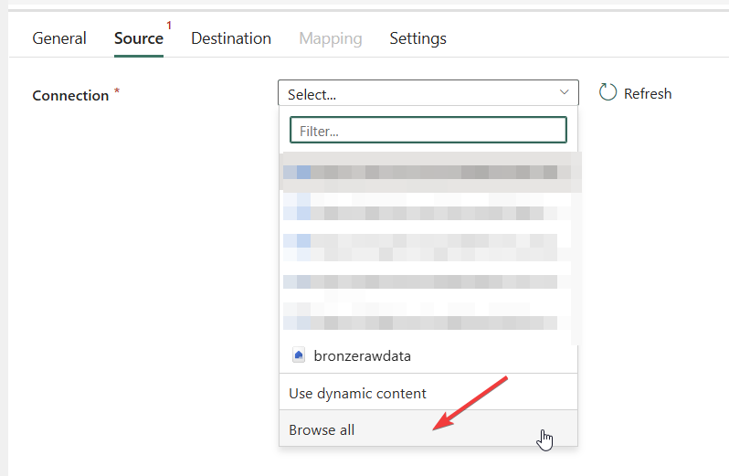

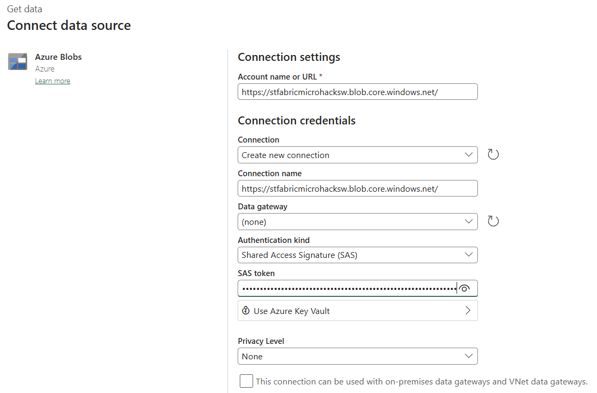

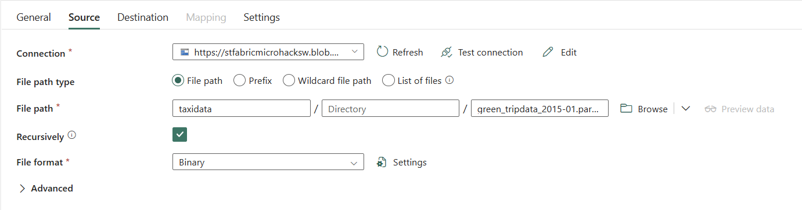

**Destination:**

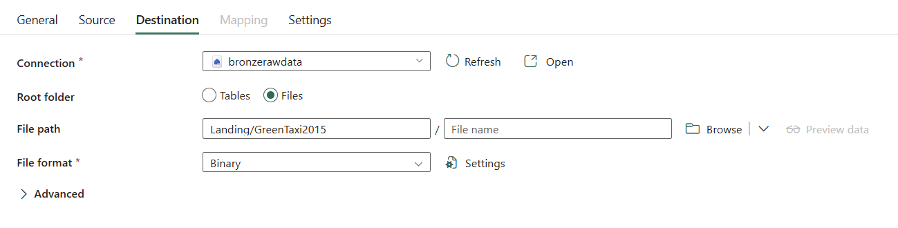

5) Don't forget to RUN the created pipeline and make sure it finishes successfully.

### Create Shortcut in your Lakehouse 

1) You have copied the taxi data from 2015 directly into your lakehouse - this time, you can just create shortcut of a different data (taxi data from 2023) and link them onto one workking place. Crete the shortcut in **Files > Landing** to **2023** Folder

So locate your lakehouse, where the Shortcut should appear:

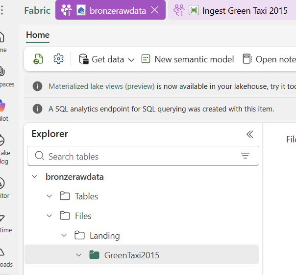

2) Within the desired folder structure create a new shortcut:

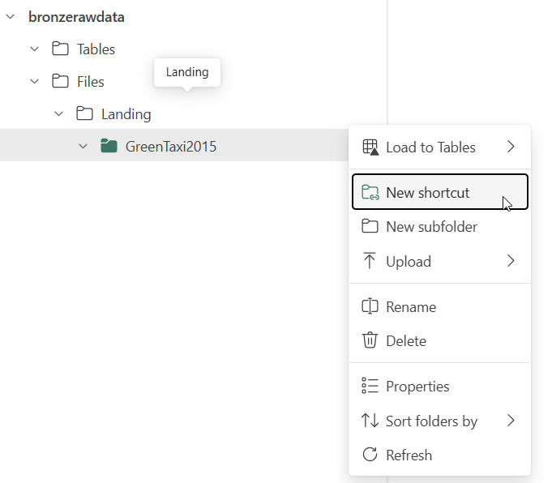

3) The source data are stored on the following source:

| **Property** | **Value** |
|:-------------|:----------|
| **Service Type** | Azure Data Lake Gen2 |
| **URL** | `https://adlstfabricmicrohacksw.dfs.core.windows.net/` |
| **Authentication** | SAS Token |
| **SAS Token** | `sv=2024-11-04&ss=b&srt=sco&sp=rl&se=2025-11-30T00:38:39Z&st=2025-10-06T15:23:39Z&spr=https&sig=HCus0m0ysS3EU4MlOrcmdmc5KNYNNHxhUS1WvkR1hRc%3D` |

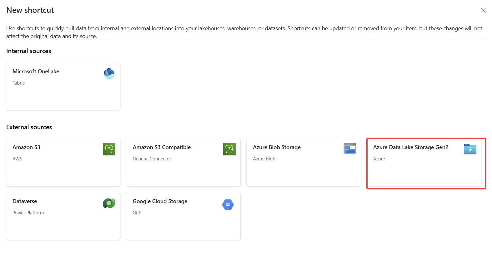

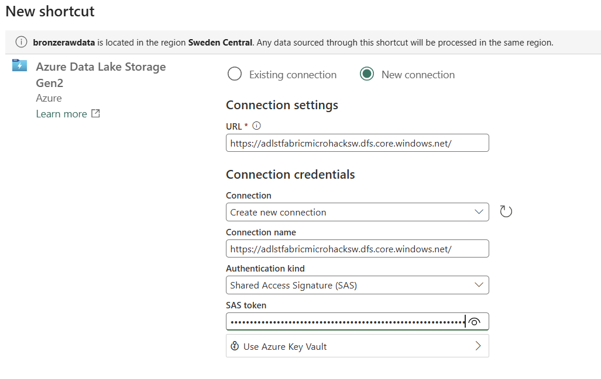

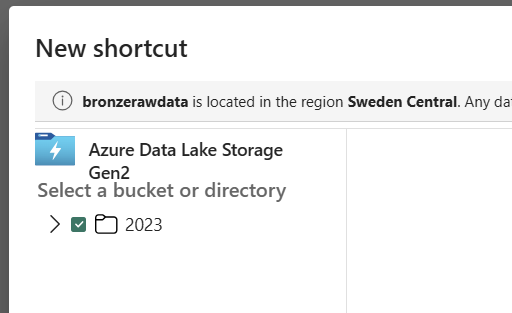

Skip the data transformation and finalize creating the shortcut.

Finally, you can see this structure in your lakehouse, while the folder *2023* resides elsewhere and the icon shows it acts as a Shortcut.

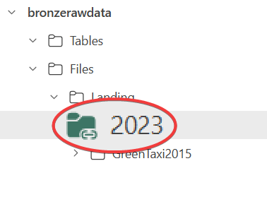

