# Ch03: Solution - Load files into delta tables

## Actions
---

### ETL Developer: Data Factory Pipeline

Create the new pipepline with the following *Source* and *Destination* input data to create lakehouse table from the source within files. With the pipeline you act as the ETL Developer.

	- Pipeline name: **Load Green Taxi 2015**
	- Source:
		- Connection: **bronzerawdata** lakehouse
		- Root folder: **Files**
		- File path: **Landing/GreenTaxi2015/green_tripdata_2015-01.parquet**
		- File format: **Parquet**


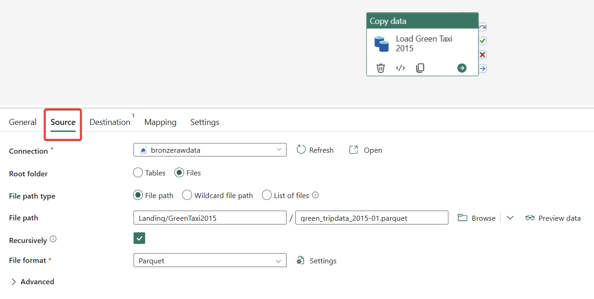

	- Destination: 
		- Connection: **bronzerawdata** lakehouse
		- Root folder: **Tables**
		- Table: **green201501** (new table)
		- Table action: **Overwrite**

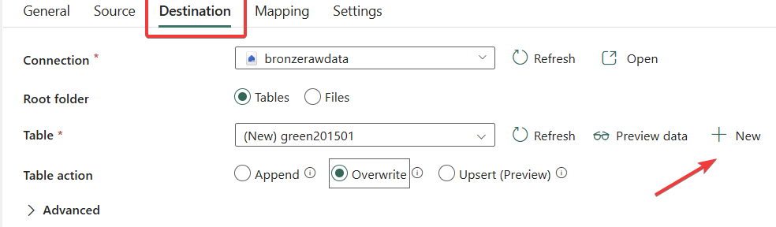

*Don't forget to run the pipeline!!!*


### Citizen Data Developer: Data Factory Dataflow Gen2

This time, you will try to use the Dataflow Gen2 tool to load the data. 

1) From the list of New Items, choose the Dataflow Gen2:

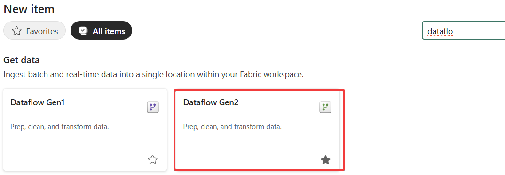

2) You will need the following input data to load the CSV file 

	- Source: **bronzerawdata** lakehouse
		- File path: **Files > Landing > 2023 > NYC-Taxi-Discounts-Per-Day.csv**
	- Destination: **bronzerawdata** lakehouse
	- Table: greenDiscountsPerDay

3) As the source for the data, you need the Lakehouse file structure - choose Lakehouse from other sources:

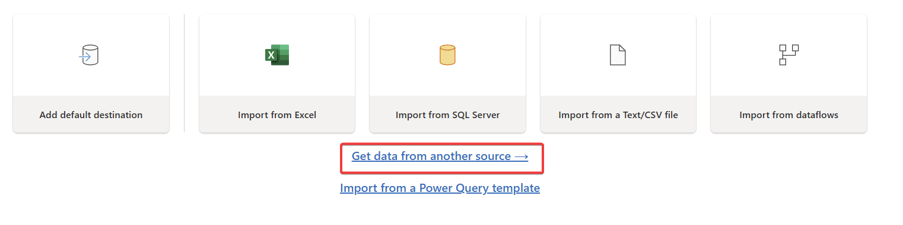

4) Choose your lakehouse as the data source:


5) Choose the shortcut folder present in the lakehouse structure and Create the DataFlow Gen2:

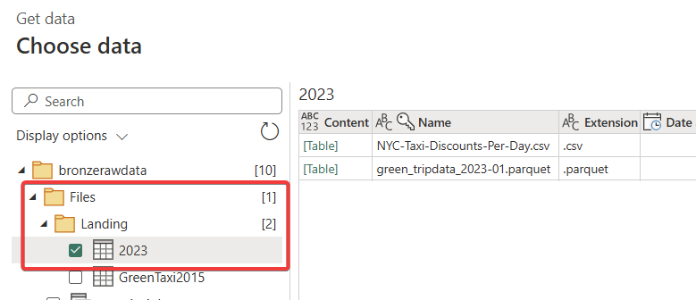

6) Choose the proper concrete CSV file to be imported:

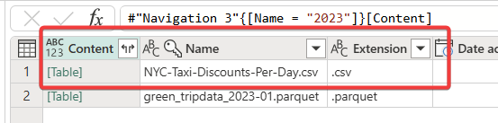

7) In this step you can transform the data source CSV, however we won't do it. Now, you have to add the destination, where the transformed data should be loaded. Add the Destination in the right bottom of the page and choose *Lakehouse*:

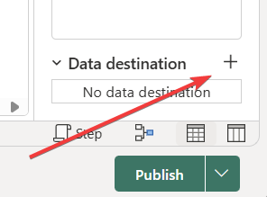

8) Confirm the current connection to lakehouse and define the placement and name for the target table, where the CSV data should be loaded:

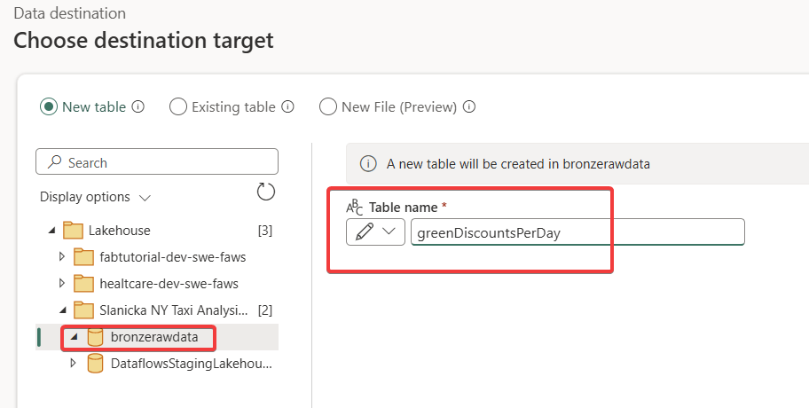

9) Even though the souce data contains column names, it is CSV and the system has not means how to preserve the table definition. To fix the column names, click on the "Use first row as header".

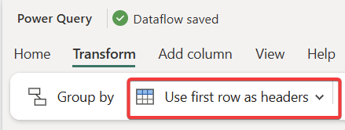

10) The columns data types mapping can be left in this case to automatic - Save the settings.

11) When everything is ready, publish the dataflow:

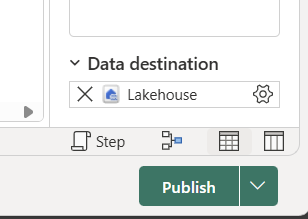

12) It is important to understand that publishing the dataflow only stores the metadata and the flow itself has not been executed yet. In order to manually trigger the dataflow, you have to "Refresh" the dataflow from within the UI of the Dataflow Gen2 itself OR from the list in Workspace view OR you can schedule the automatic triggering from the Settings of the dataflow.

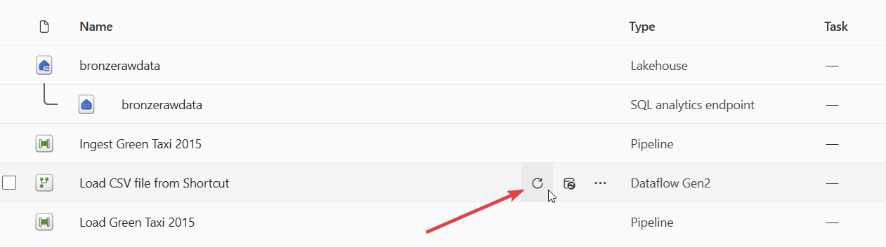

### Data Engineer: Notebook

1) As always, create a new item within your workspace - Notebook:


2) If you are familiar with PySpark and Pandas, create a code to import the parquet file and create a table within the same lakehouse. Follow the instructions below.

	- Create a new Notebook: **Load Green Taxi 2023 from pq to tbl**
	- Source: Files/Landing/2023/green_tripdata_2023-01.parquet
	- Target: **Tables/green202315**
		- Format: **delta**
		- Mode: **overwrite**

Feel free to use Copilot or other AI assistant to help you write the code. Below, there is one version of the code which does the trick but we invite you to try on your own.

You can import suggested notebook or use this alternative code (or create some of your own).

<details>
<summary><i>Notebook parquet import code</i></summary>

```python
# Import Spark session if not already imported
from pyspark.sql import SparkSession

spark = SparkSession.builder.getOrCreate()

# Define the file path and table path
file_path = 'Files/Landing/2023/green_tripdata_2023-01.parquet'
table_name = 'green202301'

# Load the parquet file into a DataFrame
df = spark.read.parquet(file_path)

# Cache the DataFrame to ensure it's properly loaded
df.cache()

# Write the DataFrame as a Delta table with all necessary options
df.write \
    .format('delta') \
    .mode('overwrite') \
    .option('delta.feature.timestampNtz', 'supported') \
    .option('overwriteSchema', 'true') \
    .option('mergeSchema', 'true') \
    .saveAsTable(table_name)

print("✅ Table created successfully with timestampNtz support!")

# Verify the table was created with all columns and data
print(f"Verification: {spark.sql(f'SELECT COUNT(*) FROM {table_name}').collect()[0][0]:,} rows")
print(f"Columns: {len(spark.sql(f'SELECT * FROM {table_name} LIMIT 1').columns)}")
```

</details>

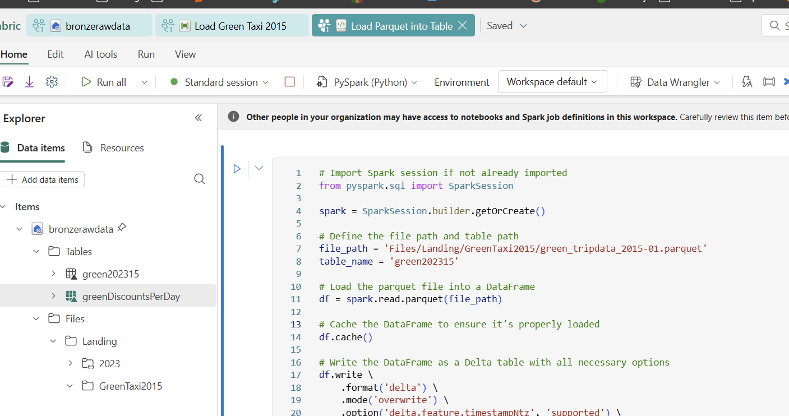

### Success Criteria
--- 
- Table **green201501** **exists** with **1 508 493** **rows**.
- Table **green202301** **exists** with **68 211** **rows**.
- Table **greenDiscountsPerDay** **exists** with **2 rows**.
