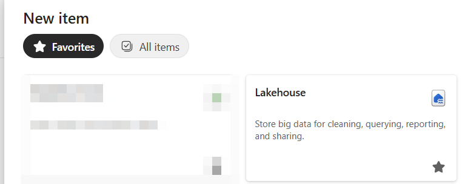
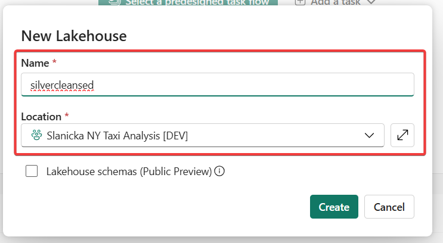
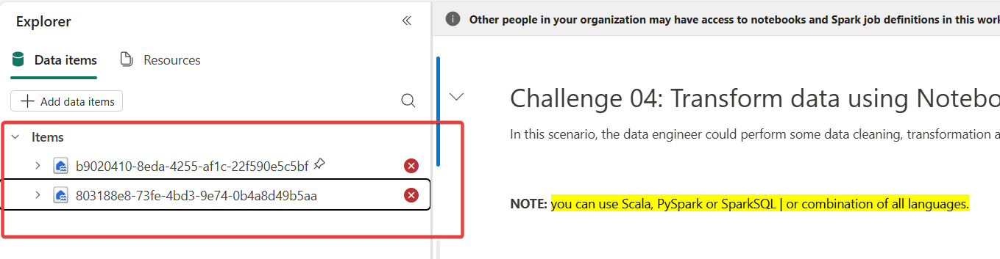
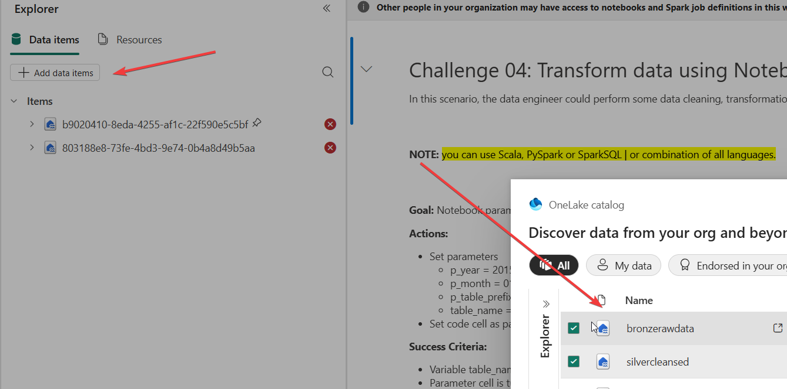
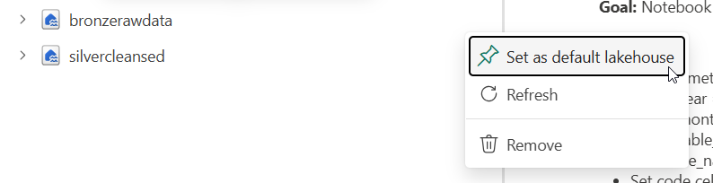

# Ch04: Solution - Transform data using Notebooks and Spark clusters (silver layer)
> [!Note]
> 
> Back to [Readme](/README.md)

## Actions

### Create the new lakehouse

1. You have already done this so in a nutshell. Go into your Workspace, create New Item - Lakehouse and name it **silvercleansed**

2. Now you need to import the notebook. From within the Workspace canvas, click on Import => Notebook => From this Computer. You can get the notebook on the following link:

[**Transform bronze to silver.ipynb**](Transform%20bronze%20to%20silver%20-%20solution.ipynb)

3. Now you can follow through the notebook itself and finish all the tasks there. The solution is included within the notebook. You will have to exchange the names of original lakehouses from Notebook and Add/attach your **bronzerawdata** (as default) and **silvercleansed** lakehouses for the notebook to be working properly.

... and change the datalakes to yours

Set the **bronzerawdata** as the default lakehouse.

