# Ch05: Solution Build gold tables and semantics layer for Power BI reporting

## Actions

### Create your 3rd lakehouse

1) The same way as before, within your workspace, create new (3rd) lakehouse called **goldcurated**

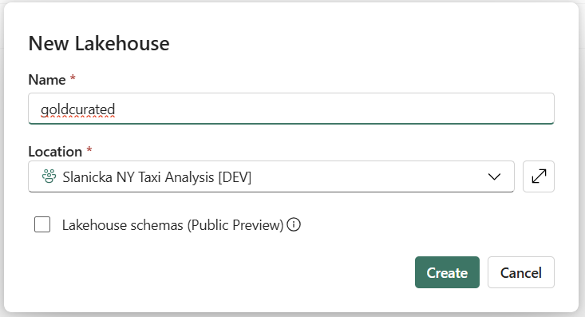

2) In your new **goldcurated** lakehouse, create Shortcut in your Lakehouse into **Tables** to pre-created delta tables:  **dimLocations, dimpaymenttype, dimratecode, dimvendor**.

The souce of this data is previously used Azure Data Lake Gen2 connection (so it is very likely you will not have to define the connection once more). 

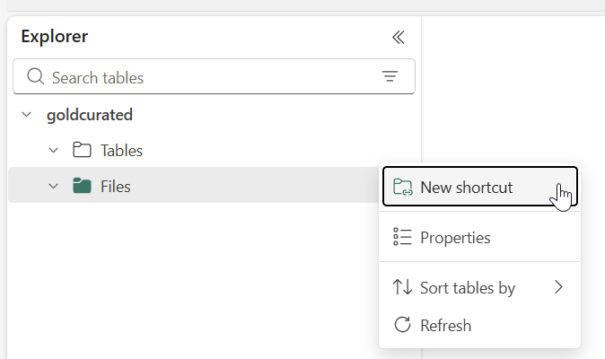

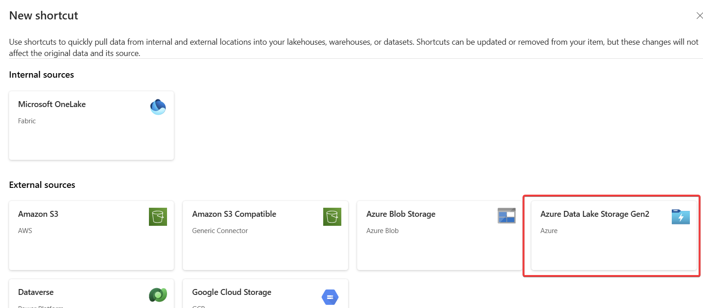

If not stored, use these credentials to access the ADLS gen2:

| **Item** | **Value** |
|:---------|:----------|
| **URL** | `https://adlstfabricmicrohacksw.dfs.core.windows.net/` |
| **SAS Token** | `sv=2024-11-04&ss=b&srt=sco&sp=rl&se=2025-11-30T00:38:39Z&st=2025-10-06T15:23:39Z&spr=https&sig=HCus0m0ysS3EU4MlOrcmdmc5KNYNNHxhUS1WvkR1hRc%3D` |

In my case, I have chosen the pre-configured connection:

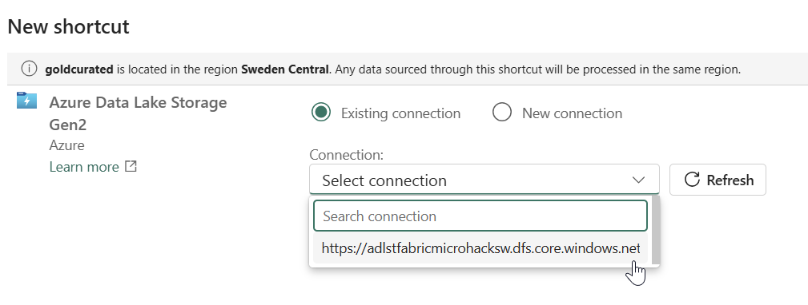

Choose all the desired tables:

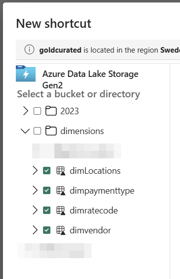

If desired, you can fix the shortcut names (by clicking the PEN icon and renaming the item) for you confirm the creation:

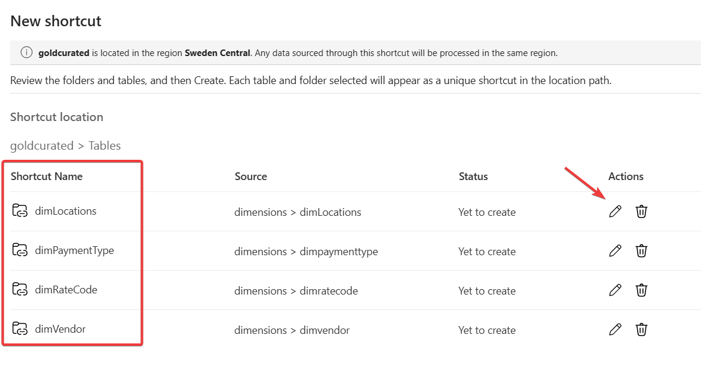

### Transform silver layer into golden using the Spark Notebook

The same way as in previous challenge, import the enclosed notebook [**Transform silver to gold - solution.ipynb**](solutions\ch05\Transform%20silver%20to%20gold%20-%20solution.ipynb).

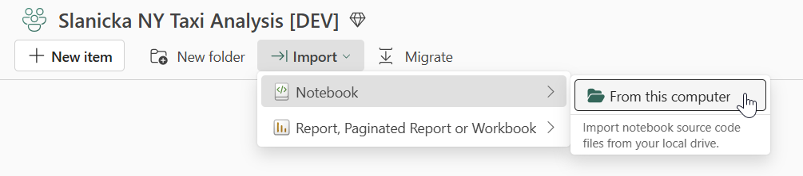

Go through all the Goas / Actions within the notebook. Obviously, you need to (again) exchange the data items to your lakehouses: **silvercleansed** (as default) and **goldcurated** as the second one.


### Build / Create Semantics model **GreenTaxi**

1) Within your workspace, open created gold layer lakehouse **goldcurated**. Click on the "New semantic model" to create one.

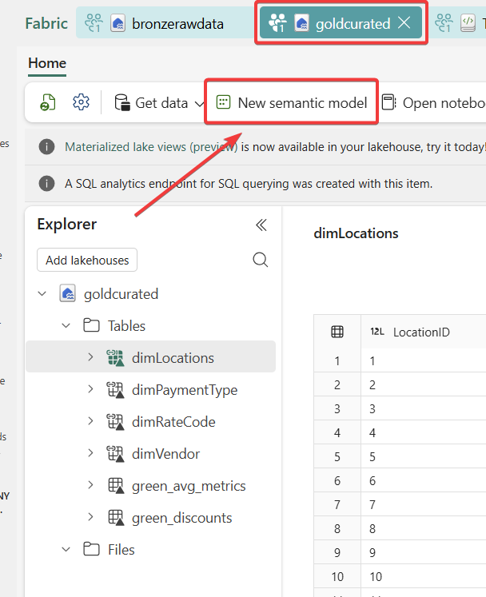

2) The new semantic model needs to be given proper name (**GreenTaxi**) & tick all the tables you want to be included within the model.

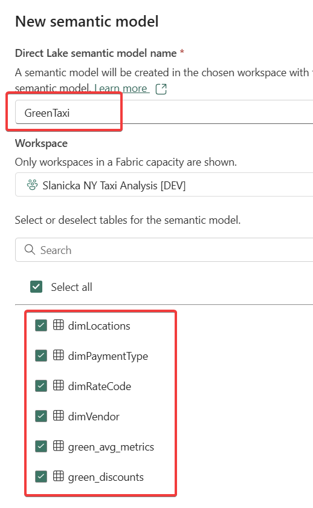

3) As you can see, the intial model load does not include the tables relationships which are crucial for later Power BI model interactivity. 

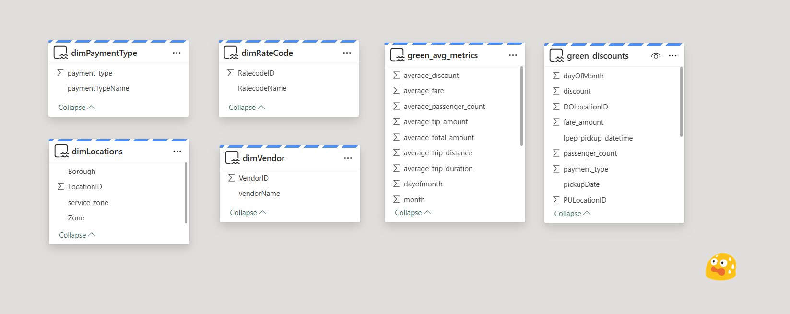

4) Now you have to define the relationships - one way of doing so is dragging the name of the column from one table to the name of target column, such as in the picture below:

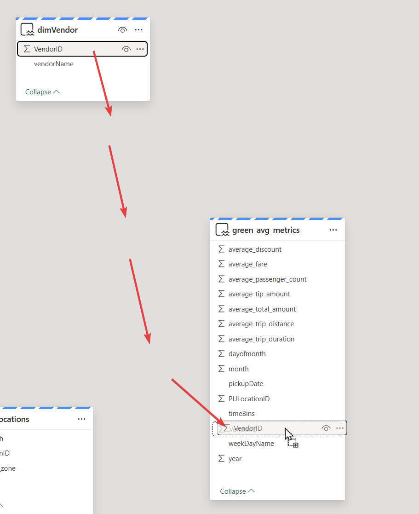

New windows pops out and now you have to define the cardinality of the relationship. In the example below, there's always only one vendor in dimension table while there can be N iterations of the vendor within the fact table - **green_avg_metrics**

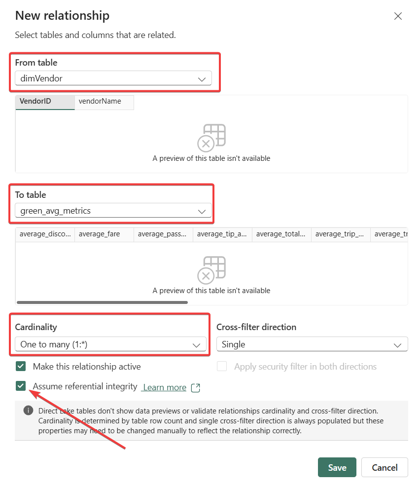

Now go one table after another and define all the posible relationships among dimension tables (dimPaymentType, dimRateCode, dimVendor) and fact tables (green_discounts, green_avg_metrics).

### Create a Power BI report

1) Create report based on **GreenTaxi** Semantic model with the following visualizations: 

	- 1 Clustered bar chart, 
	- 1 Line chart, 
	- 1 Azure maps, 
	- 1 Narrative,
	- 1 Slicer


 You can either do everything manually or try to use Power BI Copilot to generate the initial version which could be altered later.

<details>
<summary>💡 If using Power BI Copilot, you have give this prompt a try...</summary>

```
Create a new report, suggest the content of the report according to the underlying semantic model. Use the following visuals:

- 1 Clustered bar chart, 
- 1 Line chart, 
- 1 Azure maps, 
- 1 Narrative,
- 1 Slicer
```
</details>

Another way how to ask Fabric to create Power BI report for your is to use the *auto-create report* feature. Just go to the workspace view and click the 3-dots (...) next to your semantic model.

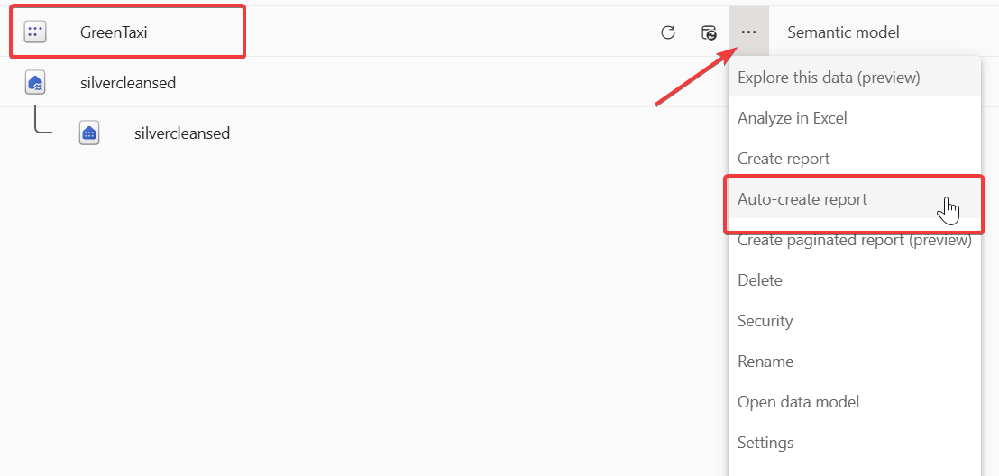

On the next page, you will have to pre-select the source data elements for your visuals. Again, you can modify the result to best suit your taste and needs.


### Create SQL View

1) Connect to your SQL Analytics Endpoint (related to your **goldcurated** lakehouse). You can do this either from your Workspace view:

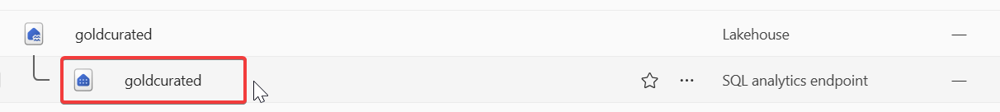

or when you are inside of the lakehouse view, you can change into SQL Analytics Endpoint in the right upper corner of the canvas:

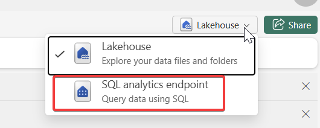

2) In the SQL Analytics Endpoint, you can choose multiple ways how to create a view. We will do the standard SQL Query mode:

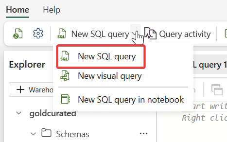

3) Create a view according to the instructions. You can write it yourself or use Copilot to help you out.

<details>
<summary>SQL code for creating the view:</summary>

```
CREATE OR ALTER VIEW dbo.vGetAverageFaresDiscounts
AS
SELECT 
     DISTINCT passenger_count, 
     ROUND(SUM(fare_amount),0) as TotalFares,
     ROUND(AVG(fare_amount),0) as AvgFares,
     ROUND(AVG(discount),0) as AvgDiscount
FROM 
    goldcurated.dbo.green_discounts
GROUP BY 
    passenger_count;
```

The script is also available [here](solutions\ch05\vGetAverageFaresDiscounts_view.sql) as a separate file.

</details>

<details>
<summary>Copilot prompt to create something like above:</summary>

```
Write a sql code snippet for creating the view named vGetAverageFaresDiscounts. This view looks into the goldcurated lakehouse tables and the columns should consist of distinct passenger count, total fares, average fares and discount grouped by the passenger count.
```
</details>

## Success Criteria

- All success criteria mentioned in the notebook are met
- 6 tables with data in **goldcurated** lakehouse exist
- Semantics model **GreenTaxi** with 2 Fact tables and 4 Dimensions exists
- Report based on **GreenTaxi** Semantics model exist
- SQL View **vGetAverageFaresDiscounts** returns 8 records

Lakehouse: **goldcurated**


Semantics model: **GreenTaxi**


Report: **Quick summary**


