# Ch06: Solution - Create a master pipeline for orchestration

## Actions / Individual Steps

### Create an Orchestration Pipeline

In this step you will have to create a new pipeline including all the steps (otherpipelines and means of data transformation). This pipeline will have to parametrized so it is usable for multiple years.


1) First you will go into the workspace view and create new pipeline - this will be the "master" orchestration pipeline.

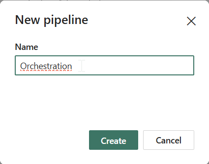

Since you have to place something on the canvas, you will have to choose items used within the orchestration pipeline. From the wizard, just choose the first one - **Invoke Pipeline** which serves as the item to .... invoke the pipeline within the flow :-)

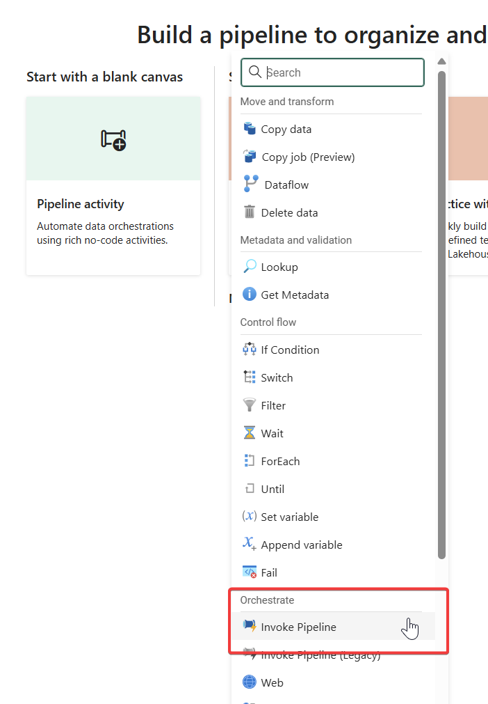


2) Now you have almost empty canvas with just one item. To defined GENERAL pipeline parameters you **have to click outside of any item** - to the free canvas. Click the *Parameters* tab in the lower part of the canvas and click "**+ New**" in order to create one.

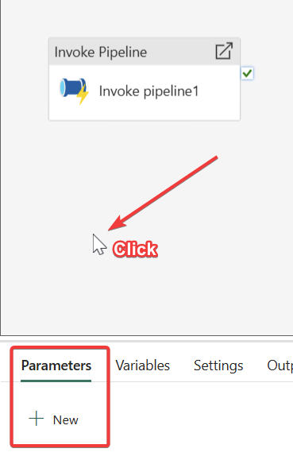

Define the new parameter for the Orchestration pipeline as instructed in Challenge guide.

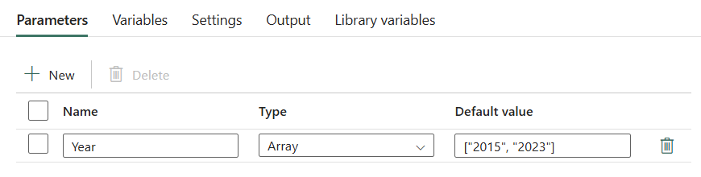

3) Now you will have to create the flow within the orchestration pipeline. Currently, you have one "Invoke Pipeline" item on the canvas and since you need more items, use the menu above to add the following items to the canvas:

- 1 additional *Invoke Pipeline*
- 1 *Dataflow*
- 1 *Notebook*

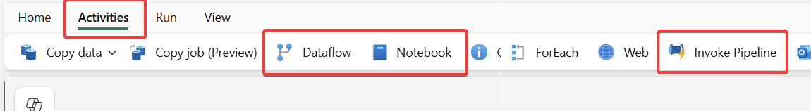

Your current canvas should look similar the the following picture:

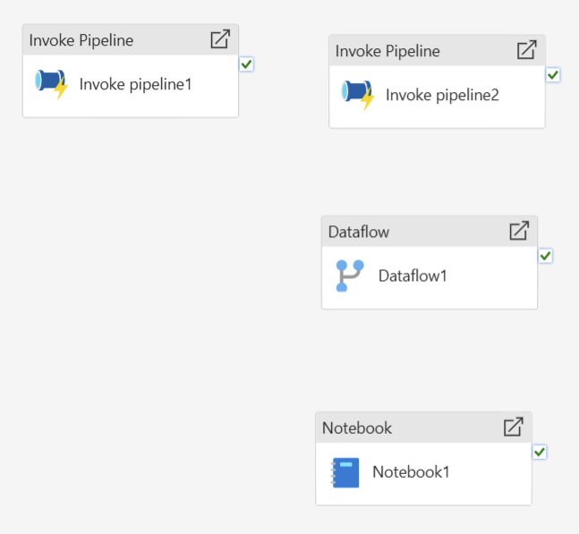

4) To invoke the right pipeline, you have to click on the first *Invoke Pipeline* item - as always within the Fabric pipelines, you set up the item properties within the lower part of canvas. Define **Ingest Green Taxi 2015** pipeline as the first item to be run.

You first give a name:

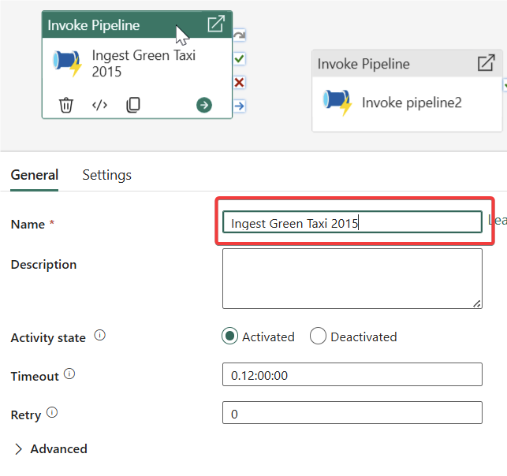

Now define the real item in this step's settings:

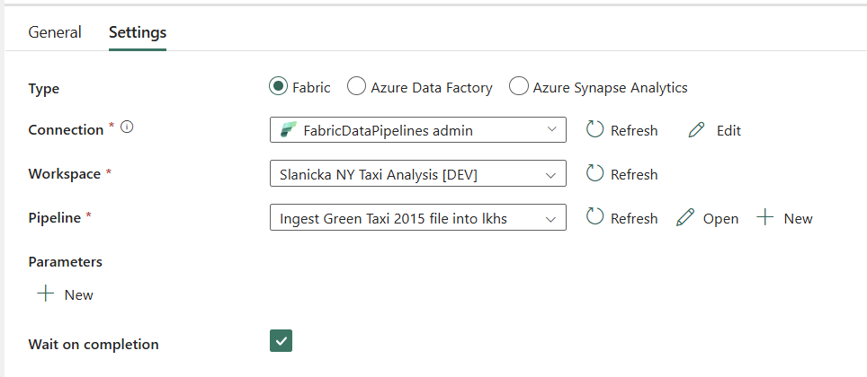

Now, you have to define the properties and settings on all the other items on the canvas.

**Load Green Taxi 2015** pipeline:

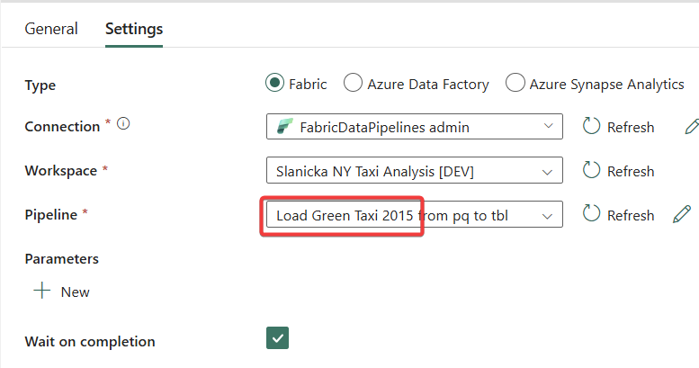

**Green Taxi Discount** dataflow:

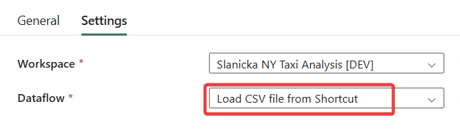

**Load Green Taxi 2023** notebook:

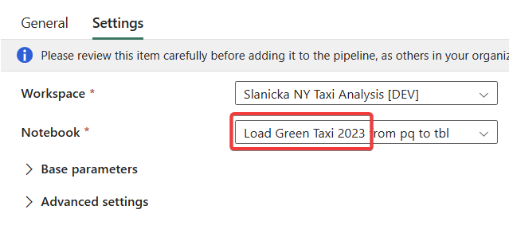

> [!TIP]
>
> Obviously, if you named your items differently during previous challenges, choose the correct items.

5) Now you have to connect some of the items - it is easy on the canvas. The instructions say "*On Success, run ...*". This done easily by clicking the "On Success" icon on originating item and dragging it onto target item. In this case, we are connecting 2 Pipelines.

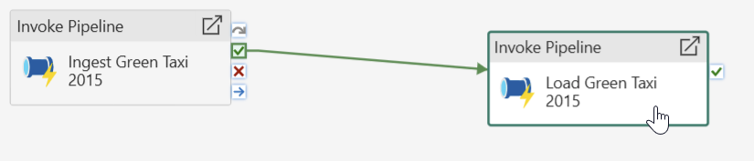

Dataflow and Notebook items will start in parallel and don't have to be linked (upon status) to any previous item.

6) Now comes the funny part. For each year, you will have to run the notebook and pass it as a parameter to that notebook each time it runs.

Add the *ForEach* item on the canvas and connect it with previous items (so the ForEach loop starts upon their completion).

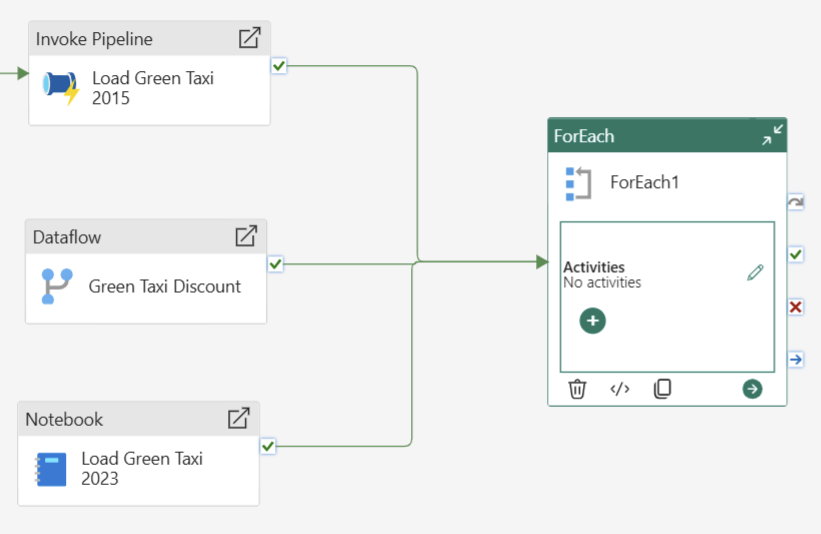

Now let's configure the *ForEach* item:

Firstly give it a proper name (for example **For Each Year**).
Click on the "+" to add the activity and choose **Transform Bronze to Silver** notebook:

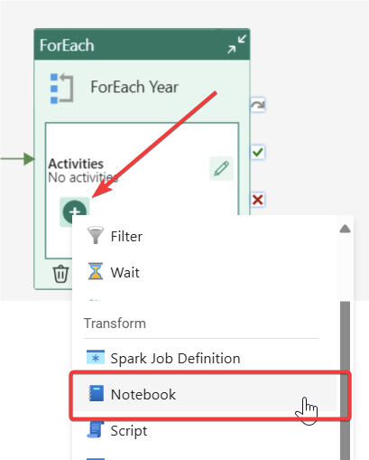

Click on the newly added Activity item (notebook) so we can configure it:

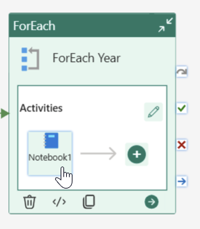

Exactly according to instructions, call the right notebook (*Transform Bronze to Silver*), define the parameter (one of those this notebook expects) - **p_year** as String and as a value, choose the *Dynamic content*:


Pipeline Expression Builder pops out (so you don't have to write the code yourself) - here, you can click the general parameter defined previously. This builds the code ```@item()```

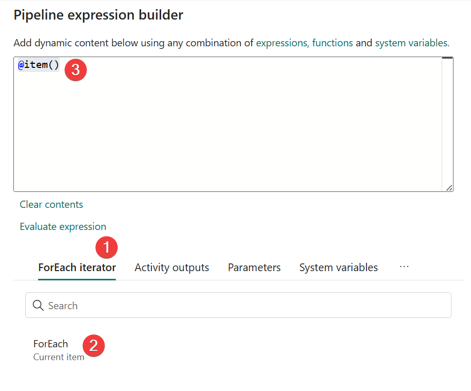

Now go back to the the **ForEach** item settings and make sure what and how is looped = Sequentially and choose the defined "internal" ForEach Activity as the dynamic item to be called. This portion should produce the code ```@pipeline().parameters.Year```

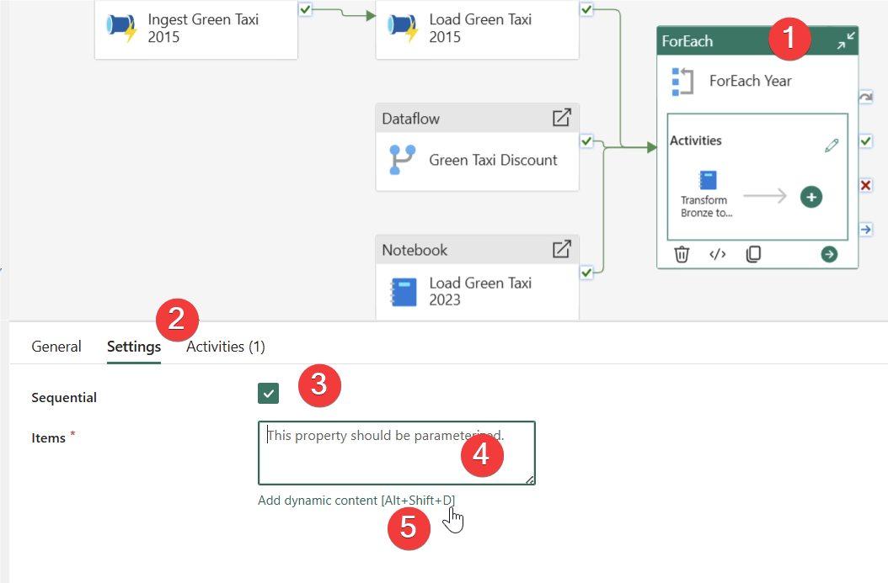

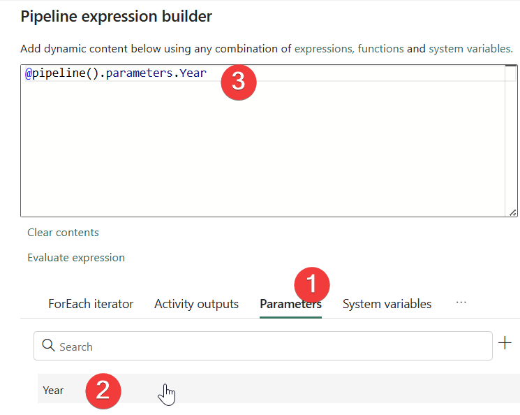


7) Finally, add the last part - upon completion of the ForEach item, call the last notebook *Transform Silver to Gold*. At this level, you should easily finish this step on your own.

Now you can Save, Validate and Run your Orchestration pipeline and the output should look like exactly the same as below in *Success Criteria* part of this solution guide

## Success Criteria
- Pipeline finishes successfully


