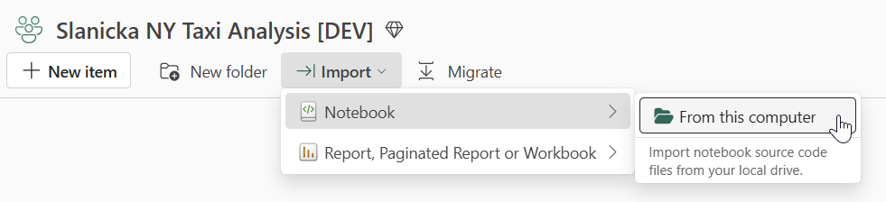
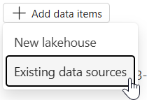
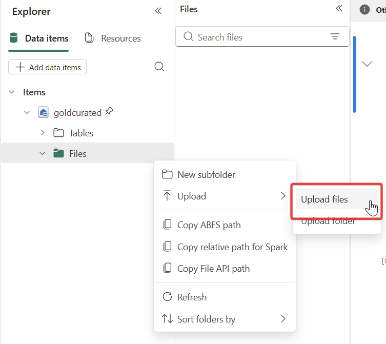

# Ch07: Solution - Process unstructured data with an LLM

> [!TIP]
It’s up to you which option you choose, but this challenge is designed for **AI functions**.

## Actions / Steps

Even though the topic of this Challenge is very interesting, from the solution point of view, it is quite easy.

1) for the sake of simplicity, we will use the previously created and populated lakehouse **goldcurated**

2) Import the enclosed notebook [User reviews processing with LLM - AI Functions - solution.ipynb](solutions\ch07\User%20reviews%20processing%20with%20LLM%20-%20AI%20Functions%20-%20solution.ipynb)

3) As with every imported notebook, again don't forget to exchange the main data item - add the **goldcurated** and make it a default lakehouse for this notebook.

4) Take the file [NY_places_customer_reviews.csv](/sourcedata/adl/reviews/NY_places_customer_reviews.csv) and upload it into the *Files* section of your lakehouse.

You can do this either from the lakehouse view of directly within your newly imported notebook:

Now go carefully step by step through the notebook to understand, how to use the AI Functions functionality in data wrangling.

## Success Criteria

- All success criteria mentioned in the notebook are met
- Table goldcurated.reviewLocations exists with 265 rows and AI columns

