# Ch08: Solution - Data Agent: Talk with your data

## Actions / Steps

### Create new Data Agent

1) As usual, you will have to create a new item within your workspace. Later, in your environment, don't forget this is a preview feature and thus it needs to be allowed by your admin on the tenant level to show up within your *Items* list.

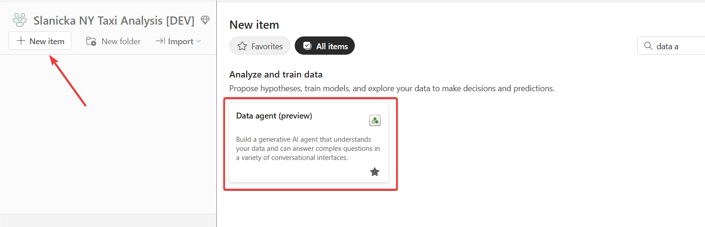

Give it a name according to your preference:

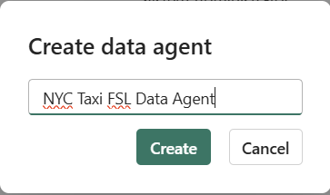

2) Add the data sources according the instructions:

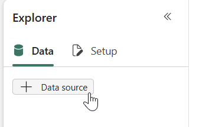

**Semantic model:** *GreenTaxi* 

    Tables:
        - dimLocations
        - dimpaymenttype
        - dimratecode
        - dimvendor
        - green_discount

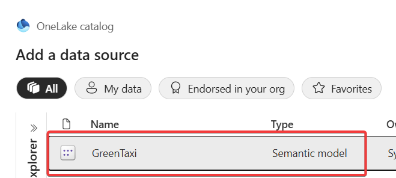

Now choose the tables want to include in your *Data Agent*:

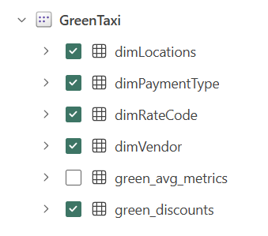

**Lakehouse**: *goldcurated*

    Tables:
        - dimLocations
        - reviewLocations

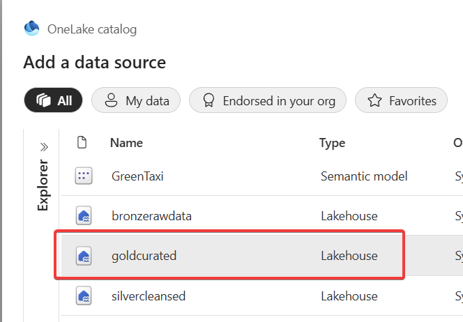

and choose the tables:

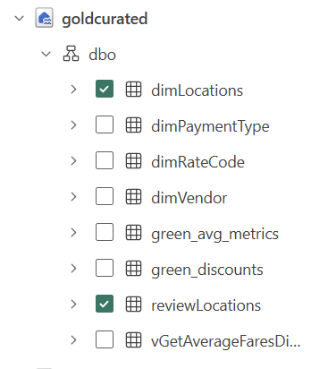

### Test your data agent

At this stage the Data Agent is operational and ready to be tested. However, as always with AI, you need to tune the data source behaviour, general agent instructions to avoid LLM from halucinating and making mistakes. Generally, you need to make sure the agent avoids common mistakes when you offer it to the "business public" within your organization.

Below is the list of prepared questions you can use with this agent (or make up your own):

    - What were the most common pickup locations for green taxi rides in 2023?
    - On which weekday do people travel from the airport the most?¨
    - How many rides were in Boston?
    - How many rides were there in 2025?
    - Show me the top 3 districts in New York with the best accommodation.
    - Show me the districts where the most passengers moved from.
    - Show me the districts where most passengers moved from, and what reviews, sentiments, and key topics you know about these districts.

### Tune your data agent

You have a multiple ways how to influence the behaviour of the agent itself. First and foremost, there are **Agent instructions** - these serve as the standard LLM system prompt - to ground the behaviour and avoid halucinations.

1) You can define and change these instructions using the following button within Fabric Data Agent screen:

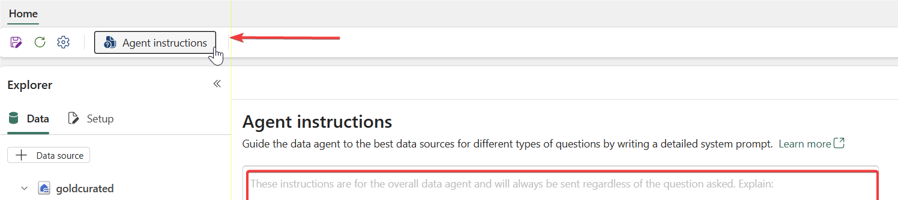

You can try to instruct the agent according to your trial & fail approach. If needed, you can use the following [instructions created by MicroHack team for you](Agent_instructions.md).

2) Another means how to influence the behaviour is *data source specific* instructions. These are typically needed in circumstances when you have to **define the data source relationships** for the LLM model.

These instructions can be accessed by using the (...) menu PER DATA SOURCE.

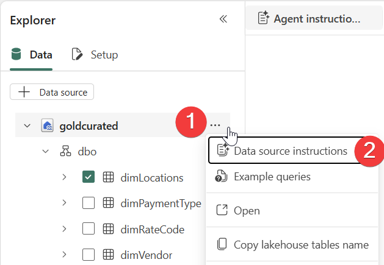

Generally, the relationships within the Semantic Model are defined by designed, however it is not usual in your Lakehouse environment. Construct the instructions for lakehouse entities internally. If lost, [these instructions for the this specific lakehouse have been created for your by the MicroHack team](Lakehouse_instructions.md).

### Publish & Consume the Data Agent

At the state the Fabric Data Agent should be tested and ready to be published. This is done easily be using the button within the Data Agent page:

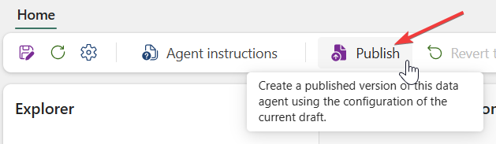

You should describe it properly so the users are able to understand, what this agent is able to help with and what is NOT able to help with.

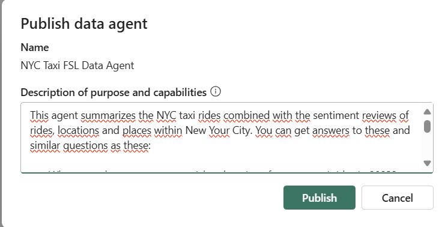

The has been published and could be consumed outside of Fabric. You can access the remote link to this agent by pressing agent Settings and *Publishing* part of it.

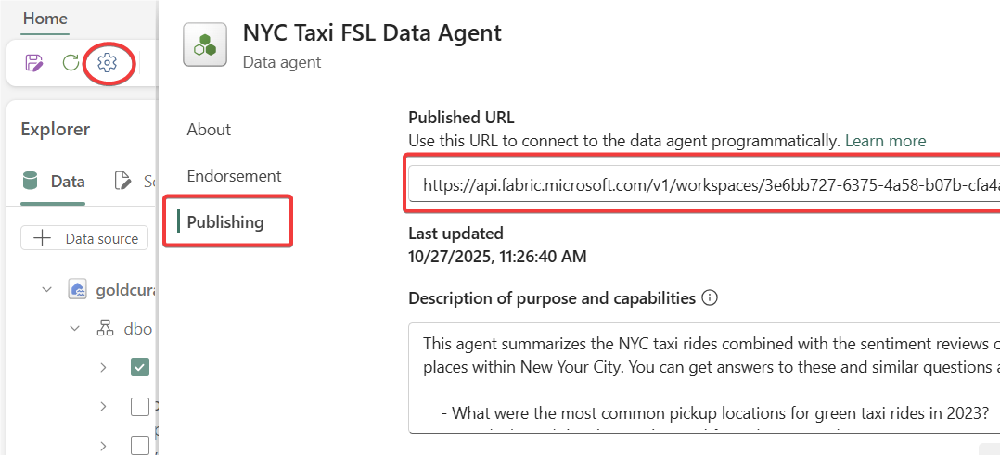

### Consume Data Agent via Copilot (Home) in Power BI or PythonSDK

The simplest how the Fabric Data Agent could be consumed is within the Fabric Copilot experience. 

1) Click the Fabric Copilot icon within the left main Fabric menu:

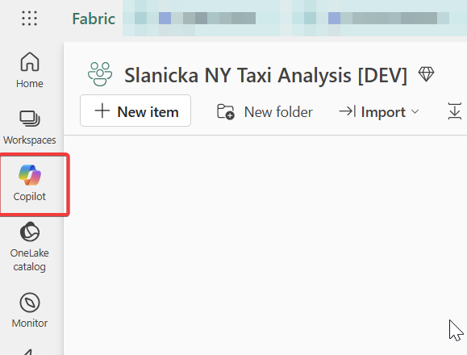

2) Now you can influece, "what the discussion will be about" by clicking the button "**+ Add items for better insights**".

At this point, you can add your newly created agent, furthermore you can add multiple agents and other items created within your companies.

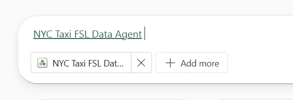

3) Alternatively, you can use Azure AI Foundry, Microsoft Copilot Studio or the Python SDK to consume your Fabric Data Agent within your solutions. All these ways are described on [Microsoft Fabric Data Agents Documentation page(https://learn.microsoft.com/en-us/fabric/data-science/consume-data-agent-python)].

Other means are clickable within the left column and will be probably growing:

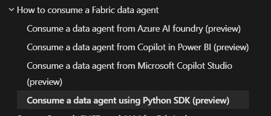

## Success Criteria
- Data Agent exists and is able to answer questions about data in Semantics model and Lakehouse.
- Data Agent is available via Python SDK or Copilot (Home) in Power BI
- Data Agent can answer questions with correct answers.

Link to the complete [Success Criteria listed in Challenge 08 document](../../challenges/ch08/README.md#success-criteria).

**Data Agent:**

**Copilot (Home) in Power BI:**

